# DALS Architecture Diagram

## Digital Assets Logistics System - Complete Architecture

```mermaid
graph TB
    %% External Users and Systems
    subgraph "External Interfaces"
        WEB[Web Browsers]
        API[API Clients]
        BLOCKCHAIN[Ethereum Blockchain]
        IPFS[IPFS Network]
        MARKETPLACES[NFT Marketplaces]
    end

    %% User Interaction Layer
    subgraph "User Interaction Layer"
        DASHBOARD[Dashboard Server<br/>Port 8008]
        LANDING[Landing Pages<br/>tritumark/, alpha-certsig/]
        API_GATEWAY[API Gateway<br/>Port 8003]
    end

    %% Core DALS Systems
    subgraph "Core DALS Systems"
        ISS[ISS Module<br/>iss_module/<br/>Core Orchestrator]

        subgraph "ISS Components"
            ISS_API[FastAPI Router<br/>api/]
            ISS_CORE[Core Logic<br/>core/]
            ISS_INTEGRATIONS[External Integrations<br/>integrations/]
            ISS_INVENTORY[Asset Inventory<br/>inventory/]
            ISS_STATIC[Static Assets<br/>static/]
            ISS_TEMPLATES[HTML Templates<br/>templates/]
        end

        UCM[Unified Cognition Module<br/>UCM<br/>Port 8080<br/>Cognitive Brain]

        CALEON[CALEON Security Layer<br/>caleon_security_layer.py<br/>Ethical Validation]
    end

    %% Knowledge Immortality Engine
    subgraph "Knowledge Immortality Engine"
        KIE[Knowledge NFT Builder<br/>knowledge/nft_builder.py<br/>Pipeline Orchestrator]

        subgraph "KIE Components"
            INTERVIEW[AI Interview Engine<br/>interview_engine.py]
            STRUCTURER[Knowledge Structurer<br/>structurer.py]
            IPFS_PACKAGER[IPFS Packager<br/>ipfs_packager.py]
            NFT_BUILDER[NFT Metadata Builder<br/>nft_metadata.py]
        end
    end

    %% Supporting Systems
    subgraph "Supporting Systems"
        TASK_ORCHESTRATOR[Task Orchestrator<br/>task-orchestrator/<br/>Gradle/Kotlin]

        TRUEMARK[Truemark Minting<br/>truemark-mint/<br/>NFT Minting Engine]

        ALPHA_CERTSIG[Alpha CertSig<br/>alpha-certsig/<br/>Certificate Generation]

        SERIAL_VAULT[Serial Assignment<br/>serial_assignment.py<br/>Asset Serialization]
    end

    %% Infrastructure Layer
    subgraph "Infrastructure Layer"
        subgraph "Container Orchestration"
            DOCKER_COMPOSE[Docker Compose<br/>docker-compose.yml]
            KUBERNETES[Kubernetes<br/>k8s/]
        end

        subgraph "Data Services"
            REDIS[(Redis<br/>Port 6379<br/>Caching)]
            CONSUL[(Consul<br/>Port 8500<br/>Service Discovery)]
        end

        subgraph "Deployment Scripts"
            DEPLOY_SH[deploy.sh<br/>Production Deploy]
            DEPLOY_IONOS[deploy-ionos.sh<br/>IONOS Deploy]
            DEPLOY_K8S[deploy-k8s.sh<br/>K8s Deploy]
        end
    end

    %% Data Flow Connections
    WEB --> DASHBOARD
    WEB --> LANDING
    API --> API_GATEWAY

    API_GATEWAY --> ISS
    DASHBOARD --> ISS

    ISS --> ISS_API
    ISS --> ISS_CORE
    ISS --> ISS_INTEGRATIONS
    ISS --> ISS_INVENTORY

    ISS_INTEGRATIONS --> UCM
    ISS_CORE --> CALEON

    ISS --> KIE
    KIE --> INTERVIEW
    KIE --> STRUCTURER
    KIE --> IPFS_PACKAGER
    KIE --> NFT_BUILDER

    KIE --> IPFS
    NFT_BUILDER --> BLOCKCHAIN
    NFT_BUILDER --> MARKETPLACES

    ISS --> TASK_ORCHESTRATOR
    ISS --> TRUEMARK
    ISS --> ALPHA_CERTSIG
    ISS --> SERIAL_VAULT

    DOCKER_COMPOSE --> ISS
    DOCKER_COMPOSE --> UCM
    DOCKER_COMPOSE --> REDIS
    DOCKER_COMPOSE --> CONSUL

    KUBERNETES --> ISS
    KUBERNETES --> UCM
    KUBERNETES --> REDIS
    KUBERNETES --> CONSUL

    DEPLOY_SH --> DOCKER_COMPOSE
    DEPLOY_IONOS --> DOCKER_COMPOSE
    DEPLOY_K8S --> KUBERNETES

    %% Security and Validation Flows
    CALEON -.->|Validates| UCM
    CALEON -.->|Validates| KIE
    CALEON -.->|Validates| BLOCKCHAIN

    %% Data Persistence
    ISS_INVENTORY -.->|Stores| REDIS
    ISS -.->|Registers| CONSUL
    KIE -.->|Stores| IPFS

    %% Styling
    classDef coreSystem fill:#e1f5fe,stroke:#01579b,stroke-width:2px
    classDef supportingSystem fill:#f3e5f5,stroke:#4a148c,stroke-width:2px
    classDef infrastructure fill:#e8f5e8,stroke:#1b5e20,stroke-width:2px
    classDef external fill:#fff3e0,stroke:#e65100,stroke-width:2px
    classDef userInterface fill:#fce4ec,stroke:#880e4f,stroke-width:2px

    class ISS,UCM,CALEON,ISS_API,ISS_CORE,ISS_INTEGRATIONS,ISS_INVENTORY,ISS_STATIC,ISS_TEMPLATES coreSystem
    class KIE,INTERVIEW,STRUCTURER,IPFS_PACKAGER,NFT_BUILDER coreSystem
    class TASK_ORCHESTRATOR,TRUEMARK,ALPHA_CERTSIG,SERIAL_VAULT supportingSystem
    class DOCKER_COMPOSE,KUBERNETES,REDIS,CONSUL,DEPLOY_SH,DEPLOY_IONOS,DEPLOY_K8S infrastructure
    class WEB,API,BLOCKCHAIN,IPFS,MARKETPLACES external
    class DASHBOARD,LANDING,API_GATEWAY userInterface
```



## Component Details

### 🎯 Core Systems

#### ISS Module (`iss_module/`)
- **Purpose**: Central orchestrator for Digital Asset Logistics
- **Components**:
  - `api/` - FastAPI routers for all endpoints
  - `core/` - Business logic and utilities
  - `integrations/` - External service connectors
  - `inventory/` - Asset tracking and management
  - `static/` - Frontend assets (CSS, JS, images)
  - `templates/` - HTML templates for dashboard

#### Unified Cognition Module (UCM)
- **Purpose**: AI cognitive brain and decision engine
- **Location**: Separate service on port 8080
- **Function**: Reasoning, decision making, thought processing

#### CALEON Security Layer
- **Purpose**: Ethical validation and consent gates
- **Features**: Drift monitoring, tamper seals, honeypot mode, founder override

### 🧠 Knowledge Immortality Engine (`knowledge/`)
- **Purpose**: Preserve human expertise as NFTs
- **Pipeline**: Interview → Structure → IPFS → NFT → Mint
- **Components**:
  - `interview_engine.py` - AI-powered profession-specific interviews
  - `structurer.py` - Knowledge extraction and categorization
  - `ipfs_packager.py` - Decentralized storage with integrity
  - `nft_metadata.py` - ERC-721 metadata and certificates

### 🏗️ Supporting Systems

#### Task Orchestrator (`task-orchestrator/`)
- **Tech**: Gradle/Kotlin microservice
- **Purpose**: Workflow orchestration and task management

#### Truemark Minting (`truemark-mint/`)
- **Purpose**: NFT minting engine for digital assets
- **Features**: Smart contract integration, metadata generation

#### Alpha CertSig (`alpha-certsig/`)
- **Purpose**: Certificate generation and signing
- **Features**: Cryptographic certificates, verification systems

### 🛠️ Infrastructure

#### Container Orchestration
- **Docker Compose**: Local development environment
- **Kubernetes**: Production deployment with autoscaling

#### Data Services
- **Redis**: Caching and session management (port 6379)
- **Consul**: Service discovery and configuration (port 8500)

#### Deployment Scripts
- `deploy.sh` - Standard production deployment
- `deploy-ionos.sh` - IONOS-specific deployment
- `deploy-k8s.sh` - Kubernetes deployment with Caleon Prime

### 🌐 Service Ports

| Service | Port | Purpose |
|---------|------|---------|
| ISS API | 8003 | Main API endpoints |
| Dashboard | 8008 | Web interface |
| UCM | 8080 | Cognitive engine |
| Redis | 6379 | Caching |
| Consul | 8500 | Service discovery |

### 🔄 Data Flows

1. **User Interaction**:
   - Web browsers → Dashboard (port 8008)
   - API clients → ISS API (port 8003)

2. **Core Processing**:
   - ISS → CALEON validation → UCM reasoning
   - Knowledge preservation → IPFS storage → NFT minting

3. **Infrastructure**:
   - Docker/K8s orchestration → Service deployment
   - Consul service discovery → Load balancing
   - Redis caching → Performance optimization

### 🔒 Security Architecture

- **CALEON Layer**: Validates all AI operations
- **IPFS Integrity**: Cryptographic content verification
- **Blockchain Immutability**: Eternal knowledge preservation
- **Founder Override**: Emergency human control

### 📊 Scalability Features

- **Horizontal Pod Autoscaling**: Automatic scaling based on load
- **Vertical Pod Autoscaling**: Resource optimization
- **Predictive Scaling**: AI-driven capacity planning
- **Custom Metrics**: Application-specific scaling triggers

---

## Quick Reference

### Development Commands
```bash
# Local development
docker-compose up -d

# API testing
curl http://localhost:8003/health

# Dashboard access
open http://localhost:8008

# Knowledge preservation
python knowledge/demo.py
```

### Production Deployment
```bash
# Standard deployment
./deploy.sh

# IONOS deployment
./deploy-ionos.sh

# K8s with Caleon Prime
./k8s/deploy-caleon-prime.sh deploy
```

### Key Files
- `iss_module/api/api.py` - Main FastAPI application
- `iss_module/core/caleon_security_layer.py` - Security gateway
- `knowledge/nft_builder.py` - Knowledge immortality pipeline
- `docker-compose.yml` - Local development stack
- `k8s/` - Production Kubernetes manifests

This diagram represents the complete DALS architecture as a sovereign AI system for digital asset logistics and knowledge preservation.</content>
<parameter name="filePath">c:\Users\bryan\OneDrive\Desktop\Digital Assets Logistics Systems\DALS-ARCHITECTURE-DIAGRAM.md